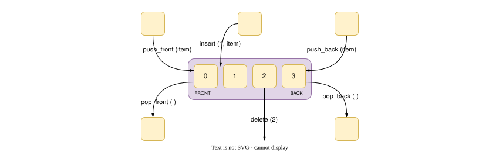

# Arrays in SystemVerilog: A Deep Dive

## Introduction to SystemVerilog Arrays

Arrays are fundamental data structures in SystemVerilog, designed to efficiently manage collections of data elements. SystemVerilog offers a rich array landscape, providing various array types tailored to diverse hardware modeling and verification needs. Understanding these types is crucial for effective SystemVerilog programming. The primary array categories in SystemVerilog include:

- **Packed Arrays**: Think of these as dense, contiguous blocks of bits, optimized for hardware registers and bit-level manipulations.
- **Unpacked Arrays**: These are more like traditional software arrays, holding individual elements and ideal for memory modeling and general-purpose data storage.
- **Fixed-Size Arrays**: Arrays whose size is set at compile time, offering performance and built-in methods for manipulation.
- **Dynamic Arrays**: Arrays that can be resized during simulation runtime, providing flexibility for variable-size data.
- **Associative Arrays**: Powerful key-value lookup structures, perfect for sparse memories or configuration tables where data is accessed by name or ID.
- **Queues**: Specialized ordered lists (FIFO-like), designed for efficient data insertion and removal at both ends, commonly used in testbenches and communication channels.

## Learning Goals

By the end of this chapter, you should be able to:

- Distinguish packed, fixed-size unpacked, dynamic, associative, and queue arrays.
- Declare dimensions in the correct position and access elements safely.
- Allocate, resize, search, sort, reduce, and delete array data deliberately.
- Choose an array kind based on index shape, lifetime, ordering, and verification use.
- Recognize which operations return a new collection and which operations modify an array in place.

## Packed vs. Unpacked Arrays: Memory Layout and Usage

The distinction between packed and unpacked arrays is fundamental in SystemVerilog and affects how they are stored in memory and how they are used.

### Packed Arrays: Bit-Level Efficiency

- **Contiguous Bit Storage**: Packed arrays are stored as a single, unbroken sequence of bits in memory. Imagine them as a hardware register or a contiguous memory location viewed as a bit stream.
- **Hardware Modeling Focus**: They are primarily used for modeling hardware structures where bit-level access and operations are frequent, such as registers, memory interfaces, and data buses.
- **Multi-Dimensionality**: Packed arrays can be multi-dimensional, allowing you to represent matrices or arrays of registers efficiently. Dimensions are specified **before** the variable name.

```systemverilog
logic [2:0][15:0] register_file;  // 3x16-bit register file (48 bits total)
register_file = 48'h2345_6789_ABCD; // Initialize all 48 bits as a contiguous vector

logic [7:0] byte_slice;
byte_slice = register_file[1][15:8]; // Extract a byte slice from the 2D packed array
```

**Explanation**: `register_file` is a 2D packed array representing three 16-bit elements, for 48 bits total. The 48-bit literal matches its width; assigning a wider literal would discard the excess most-significant bits. The initialization and byte slice extraction highlight the bit-contiguous nature and suitability for hardware-like operations.

### Unpacked Arrays: Element-Based Storage

- **Discrete Element Storage**: Unpacked arrays store elements as individual entities in memory. They are similar to arrays in software programming languages where each element is stored separately.
- **Verification and Data Storage**: Unpacked arrays are commonly used in verification environments for testbench data storage, scoreboards, and general-purpose data structures.
- **Dimensions After Identifier**: Dimensions are declared **after** the array identifier, resembling traditional array declarations in languages like C or Java.

```systemverilog
int transaction_data [1024];   // Array to hold 1024 integer transactions
transaction_data = '{default:0}; // Initialize all elements to 0

transaction_data[512] = 999;    // Access and modify individual elements
```

**Explanation**: `transaction_data` is an unpacked array designed to hold a large number of integer values, typical for storing testbench data. Element access is element-wise, not bit-level.

**Key Difference**: Packed arrays are for bit-level hardware modeling; unpacked arrays are for element-level data storage, especially in verification.

An unpacked dimension such as `[1024]` is shorthand for an index range `[0:1023]`. A declaration such as `[7:0]` instead has descending indices from 7 through 0. The declared index range is part of the type, so `array[0]` is not always the leftmost or highest-order element.

## Fixed-Size Arrays: Compile-Time Dimensions with Built-in Methods

- **Static Size**: Fixed-size arrays have their size determined at compile time, making them efficient and predictable in terms of memory allocation and performance.
- **Built-in Methods**: SystemVerilog provides a rich set of built-in methods for fixed-size arrays, simplifying common array operations like sorting, summing, and reversing. Many array methods also apply to dynamic arrays and queues, while associative arrays have a different supported-method set.

```systemverilog
int scores [5] = '{95, 88, 76, 99, 82}; // Fixed-size array of scores
int sorted_scores [5];

sorted_scores = scores; // Copy array
sorted_scores.sort();   // Sort 'sorted_scores' in ascending order
int max_score = sorted_scores[sorted_scores.size()-1]; // Get the maximum score

$display("Sorted scores: %p", sorted_scores); // Output: Sorted scores: '{76, 82, 88, 95, 99}
$display("Sum of scores: %0d", scores.sum());    // Output: Sum of scores: 440
```

### Built-in Methods for Fixed-Size Arrays

| Method              | Description                                         | Example                                                 |
| ------------------- | --------------------------------------------------- | ------------------------------------------------------- |
| **`.size()`**       | Returns the number of elements in the array         | `int array_size = scores.size();`                       |
| **`.sort()`**       | Sorts array elements in ascending order (in-place)  | `scores.sort();`                                        |
| **`.rsort()`**      | Sorts array elements in descending order (in-place) | `scores.rsort();`                                       |
| **`.reverse()`**    | Reverses the order of elements (in-place)           | `scores.reverse();`                                     |
| **`.sum()`**        | Calculates and returns the sum of all elements      | `int total_score = scores.sum();`                       |
| **`.min()`**        | Returns the minimum element value                   | `int min_val = scores.min();`                           |
| **`.max()`**        | Returns the maximum element value                   | `int max_val = scores.max();`                           |
| **`.unique()`**     | Returns a queue containing one instance of each value; does not remove source elements | `int unique_scores[$] = scores.unique();`               |
| **`.find()`**       | Returns a queue of indices where condition is true  | `int indices[$] = scores.find(x) with (x > 90);`        |
| **`.find_index()`** | Returns a queue of indices where condition is true  | `int indices[$] = scores.find_index(x) with (x > 90);`  |
| **`.find_first()`** | Returns the first element where condition is true   | `int first_score = scores.find_first(x) with (x > 90);` |
| **`.find_last()`**  | Returns the last element where condition is true    | `int last_score = scores.find_last(x) with (x > 90);`   |
| **`.reduce()`**     | General reduction notation is tool/methodology dependent; use named reductions for portable code | `int product = scores.product();`                       |

## Dynamic Arrays: Runtime Resizable Flexibility

- **Runtime Size Adjustment**: Dynamic arrays offer the flexibility to change their size during simulation execution. This is particularly useful when the array size is not known at compile time or needs to adapt to varying data volumes.
- **Memory Allocation with `new[]`**: You must explicitly allocate memory for dynamic arrays using the `new[]` operator before you can use them.
- **Resizing and Copying**: Dynamic arrays can be resized using `new[size](array_name)`, which allocates a new array of the specified size and copies the elements from the original array (up to the smaller of the old and new sizes).

```systemverilog
int packet_buffer []; // Declare a dynamic array (unsized)

initial begin
  packet_buffer = new[10]; // Allocate initial buffer for 10 packets
  foreach (packet_buffer[i]) packet_buffer[i] = $random; // Fill with random data

  $display("Initial buffer size: %0d", packet_buffer.size()); // Size: 10

  packet_buffer = new[20] (packet_buffer); // Resize to 20, copy first 10 elements
  $display("Resized buffer size: %0d", packet_buffer.size()); // Size: 20

  packet_buffer.delete(); // Deallocate memory, size becomes 0
  $display("Buffer size after delete: %0d", packet_buffer.size()); // Size: 0
end
```

Before indexing a dynamic array, ensure it has been allocated and that the index is within `0` through `packet_buffer.size()-1`. Assigning a new dynamic array replaces the old array handle; resizing with `new[size](old_array)` copies the overlapping prefix and initializes any newly added elements to their type's default value. If no copy is requested, the old contents are not preserved.

### Methods for Dynamic Arrays

| Method           | Description                                      | Example                                        |
| ---------------- | ------------------------------------------------ | ---------------------------------------------- |
| **`.size()`**    | Returns the current number of allocated elements | `int current_size = packet_buffer.size();`     |
| **`.new[size]`** | Allocates memory for `size` elements             | `packet_buffer = new[50];`                     |
| **`.delete()`**  | Deallocates all memory, array becomes empty      | `packet_buffer.delete();`                      |
| **`.sort()`**    | Sorts the elements in ascending order (in-place) | `packet_buffer.sort();`                        |
| **`.rsort()`**   | Sorts elements in descending order (in-place)    | `packet_buffer.rsort();`                       |
| **`.reverse()`** | Reverses the order of elements (in-place)        | `packet_buffer.reverse();`                     |
| **`.sum()`**     | Calculates the sum of all elements               | `int total = packet_buffer.sum();`             |
| **`.min()`**     | Returns the minimum element value                | `int min_val = packet_buffer.min();`           |
| **`.max()`**     | Returns the maximum element value                | `int max_val = packet_buffer.max();`           |
| **`.unique()`**  | Returns a queue of unique elements               | `int unique_vals[$] = packet_buffer.unique();` |

## Associative Arrays: Flexible Key-Based Lookup

- **Key-Value Pairs**: Associative arrays store elements as key-value pairs, where the index (key) can be of any data type (string, integer, etc.), not just sequential integers.
- **Sparse Data Storage**: They are highly efficient for storing sparse data, where only a small fraction of possible indices are actually used. Think of them as hash tables or dictionaries.
- **Lookup Tables and Configuration**: Associative arrays are excellent for implementing lookup tables, memory models with non-contiguous addresses, and configuration settings indexed by names.

Associative arrays do not have a conventional contiguous range. Use `.exists(key)` before reading a key when a missing entry is possible; reading a missing entry can create or return a default value depending on the access context and type. The ordering used by `.first()`, `.last()`, `.next()`, and `.prev()` is the associative index ordering defined by the language, not insertion order.

```systemverilog
string error_messages [string]; // Associative array with string keys and string values

initial begin
  error_messages["E100"] = "Invalid Opcode";
  error_messages["W201"] = "Memory Access Violation";

  if (error_messages.exists("E100")) begin
    $display("Error E100: %s", error_messages["E100"]); // Access by key
  end

  $display("Number of error messages: %0d", error_messages.num()); // Count entries

  string key;
  if (error_messages.first(key)) begin // Iterate through keys
    $display("First error key: %s, message: %s", key, error_messages[key]);
    while (error_messages.next(key)) begin
      $display("Next error key: %s, message: %s", key, error_messages[key]);
    end
  end
end
```

### Methods for Associative Arrays

| Method                | Description                                             | Example                                              |
| --------------------- | ------------------------------------------------------- | ---------------------------------------------------- |
| **`.num()`**          | Returns the number of entries in the array              | `int entry_count = error_messages.num();`            |
| **`.delete()`**       | Removes all entries from the associative array          | `error_messages.delete();`                           |
| **`.delete(key)`**    | Removes the entry associated with `key`                 | `error_messages.delete("W201");`                     |
| **`.exists(key)`**    | Checks if an entry with `key` exists                    | `if (error_messages.exists("E100")) ...`             |
| **`.first(ref key)`** | Assigns the first key in the array to `key` (iteration) | `string first_key; error_messages.first(first_key);` |
| **`.next(ref key)`**  | Assigns the key after the current `key` (iteration)     | `string next_key; error_messages.next(next_key);`    |
| **`.prev(ref key)`**  | Assigns the key before the current `key` (iteration)    | `string prev_key; error_messages.prev(prev_key);`    |
| **`.last(ref key)`**  | Assigns the last key in the array to `key` (iteration)  | `string last_key; error_messages.last(last_key);`    |

## Queues: Ordered Collections for Communication

- **FIFO Data Structure**: Queues are ordered collections of elements, behaving like FIFO (First-In, First-Out) queues. They allow efficient addition and removal of elements from both the front and back.
- **Dynamic Sizing**: Queues automatically resize as elements are added or removed, making them convenient for managing data streams of varying lengths.
- **Optional Bounds**: An unbounded queue uses `[$]`; a bounded queue can use `[$:N]` and must be handled when its capacity is reached.
- **Testbench Communication**: Queues are frequently used in verification testbenches for communication between different components, such as passing transaction objects between generators, monitors, and scoreboards.

<figure>
  
  <figcaption>Figure — common queue operations and behavior.</figcaption>
</figure>

```systemverilog
// Simple queue example using integers
int transaction_q[$]; // Queue of transaction IDs

initial begin
  transaction_q.push_back(10); // Add to back
  transaction_q.push_back(20);

  if (transaction_q.size() > 0) begin
    int first_txn = transaction_q.pop_front(); // Remove from front
    $display("Dequeued transaction ID: %0d", first_txn);
  end

  transaction_q.push_front(5); // Add to front
  $display("Queue size: %0d", transaction_q.size()); // Check queue size
end
```

For an unbounded queue, `push_front` and `push_back` change its size. `pop_front` and `pop_back` remove and return an element, so they should only be called when the queue is nonempty. `insert` uses a zero-based queue position. A queue is ordered storage; it is not automatically a synchronization primitive between concurrent processes.

### Methods for Queues

| Method                     | Description                                             | Example                                               |
| -------------------------- | ------------------------------------------------------- | ----------------------------------------------------- |
| **`.size()`**              | Returns the number of elements in the queue             | `int q_size = transaction_q.size();`                  |
| **`.insert(index, item)`** | Inserts `item` at the specified `index`                 | `transaction_q.insert(1, new_txn);`                   |
| **`.delete()`**            | Removes all elements from the queue                     | `transaction_q.delete();`                             |
| **`.delete(index)`**       | Removes the element at the specified `index`            | `transaction_q.delete(0);`                            |
| **`.pop_front()`**         | Removes and returns the element from the front of queue | `transaction first_item = transaction_q.pop_front();` |
| **`.pop_back()`**          | Removes and returns the element from the back of queue  | `transaction last_item = transaction_q.pop_back();`   |
| **`.push_front(item)`**    | Adds `item` to the front of the queue                   | `transaction_q.push_front(new_txn);`                  |
| **`.push_back(item)`**     | Adds `item` to the back of the queue                    | `transaction_q.push_back(new_txn);`                   |
| **`.sort()`**              | Sorts the elements in the queue (in-place)              | `transaction_q.sort();`                               |
| **`.reverse()`**           | Reverses the order of elements in the queue (in-place)  | `transaction_q.reverse();`                            |

## Choosing an Array Kind

Use the simplest array that matches the requirement:

| Requirement | Suitable choice |
|-------------|-----------------|
| One contiguous bit vector or hardware field | Packed array |
| Known element count and stable indices | Fixed-size unpacked array |
| Runtime-known count with integer indices | Dynamic array |
| Sparse or key-based lookup | Associative array |
| Ordered data with insertion/removal at either end | Queue |

Array methods such as `.sort()`, `.reverse()`, and `.shuffle()` modify the receiver in place. Query methods such as `.find()`, `.find_index()`, and `.unique()` return a queue and leave the source unchanged. Reduction methods such as `.sum()`, `.product()`, `.and()`, `.or()`, and `.xor()` return a value; check the result type and width when overflow matters.

## Exercises to Practice Array Concepts

Test your understanding of SystemVerilog arrays with these exercises. Solutions are provided to help you check your work.

The snippets are focused examples. Place procedural statements inside a module, program, class, or other legal procedural context before compiling them, and use a SystemVerilog language mode. For every dynamic array or queue operation, consider the empty and boundary cases as well as the nominal case.

1. **Packed Array Initialization**: Declare a 12-bit packed array named `config_bits` and initialize it with the hexadecimal value `0xA3C`.

   ```systemverilog
   logic [11:0] config_bits = 12'hA3C;
   // Solution: Declares a 12-bit packed array and initializes it.
   ```

2. **Unpacked Array of Strings**: Create an unpacked array named `name_list` to hold 4 strings: "Alice", "Bob", "Charlie", and "Dana". Then, use a `foreach` loop to print each name.

   ```systemverilog
   string name_list [4] = '{"Alice", "Bob", "Charlie", "Dana"};
   foreach (name_list[i]) $display("Name: %s", name_list[i]);
   // Solution: Creates and initializes an unpacked array of strings and prints each element.
   ```

3. **Fixed-Size Array Summation**: Declare a fixed-size array of 5 integers, initialize it with the values `{10, 20, 30, 40, 50}`, and use the `.sum()` method to calculate and display their sum.

   ```systemverilog
   int value_array [5] = '{10, 20, 30, 40, 50};
   $display("Sum of array elements: %0d", value_array.sum());
   // Solution: Calculates and displays the sum of the elements in the fixed-size array.
   ```

4. **Dynamic Array with Even Numbers**: Create an empty dynamic array named `even_numbers`. Allocate space for 8 integers using `new[]`. Then, use a `foreach` loop to fill the array with the first 8 even numbers (0, 2, 4, ..., 14).

   ```systemverilog
   int even_numbers [];
   even_numbers = new[8];
   foreach (even_numbers[i]) even_numbers[i] = i * 2;
   // Solution: Creates a dynamic array, allocates memory, and populates it with even numbers.
   ```

5. **Associative Array for Age Lookup**: Create an associative array named `age_map` that uses strings as keys and integers as values. Store the ages of three people: "Alice" (30), "Bob" (25), and "Charlie" (35). Then, check if an entry for "John" exists in the array and display "John not found!" if it doesn't.

   ```systemverilog
   int age_map [string];
   age_map["Alice"] = 30;
   age_map["Bob"] = 25;
   age_map["Charlie"] = 35;
   if (!age_map.exists("John")) $display("John not found!");
   // Solution: Creates an associative array, populates it with age data, and checks for the existence of a key.
   ```

6. **Queue Operations: Reverse and Pop**: Create a queue named `data_queue` and initialize it with the values `{1, 2, 3}`. Reverse the queue using `.reverse()`, and then remove and discard the element from the front of the queue using `.pop_front()`.
   ```systemverilog
   int data_queue [$] = '{1, 2, 3};
   data_queue.reverse();
   data_queue.pop_front();
   // Solution: Demonstrates reversing a queue and removing the front element.
   ```

By mastering SystemVerilog arrays and their various types, you equip yourself with powerful tools for managing data in both your hardware designs and verification environments. Experiment with these exercises and explore the extensive capabilities of SystemVerilog arrays to enhance your digital design and verification skills.

##### Copyright (c) 2026 squared-studio
