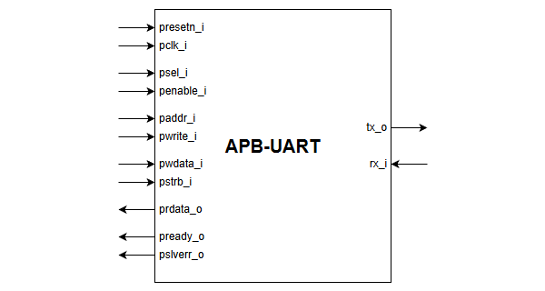

# Chapter 1: Understanding the Problem and the Language

## What You Should Learn in This Chapter

By the end of this chapter, you should be comfortable with three things:

- what the APB-UART block is supposed to do,
- why it is a good beginner example for UVM,
- and what the most common UVM words mean in plain language.

If you are completely new to UVM, start here and do not rush. A lot of confusion later comes from not having a clear picture of the DUT and the vocabulary first.

## 1.1 Why This Example Is Good for a Trainee Engineer

UVM is easier to learn when the design under test is small enough that you can follow one transaction all the way through the verification flow.

An APB-UART design is useful because it naturally splits into two views:

- a software-facing APB register view,
- a serial-data UART view.

That means you can ask very practical verification questions:

- If software writes a byte into the transmit register, does that byte really leave the UART transmitter?
- If a serial byte arrives on the receive pin, does software later read the same byte back through APB?

These are strong beginner questions because they are both realistic and easy to visualize.

## 1.2 What APB Means in This Tutorial

APB, or Advanced Peripheral Bus, is a simple on-chip bus protocol commonly used for peripheral control registers.

In this tutorial, you can think of APB as the path used by software to:

- enable the UART,
- program the baud-rate divider,
- configure parity and stop bits,
- write outgoing data,
- read incoming data.

So when you see APB traffic in this environment, think, "software is controlling the block through registers."

## 1.3 What UART Means in This Tutorial

UART, or Universal Asynchronous Receiver/Transmitter, is a serial communication interface.

Unlike APB, UART does not move data as a wide parallel bus transaction. It sends data one bit at a time using a frame that typically contains:

- a start bit,
- data bits,
- an optional parity bit,
- one or more stop bits.

In this tutorial, you can think of the UART side as the physical communication behavior of the DUT.

So when you see UART monitor traffic, think, "this is what actually happened on the serial line."

## 1.4 The Main Registers You Need to Care About

You do not need the full register map memorized to understand the training flow. A few addresses are enough.

| Address | Register | Why it matters |
|---------|----------|----------------|
| `0x00` | `CTRL` | Turns the UART on and controls flush behavior |
| `0x04` | `CLK_DIV` | Sets the baud-rate divider |
| `0x08` | `CFG` | Controls parity and stop-bit format |
| `0x14` | `TX_DATA` | APB writes a byte here for transmission |
| `0x18` | `RX_DATA` | APB reads a received byte here |

If you remember only two addresses, remember these:

- `0x14` is the APB transmit data write point,
- `0x18` is the APB receive data read point.

These two registers are the center of the scoreboard's end-to-end data checks.

## 1.5 The Core Verification Question

A beginner sometimes thinks verification means, "send some stimulus and hope nothing crashes."

That is not enough.

A better way to think about verification is this:

- define what behavior should happen,
- create stimulus that exercises that behavior,
- observe what really happened,
- compare expected behavior and observed behavior.

For this APB-UART example, the core verification questions are:

1. When APB writes `TX_DATA`, does the UART transmit side emit the same byte?
2. When the UART receive side gets a byte, does APB later read the same byte from `RX_DATA`?

Those two questions are simple, strong, and easy to measure.

## 1.6 UVM Vocabulary in Plain Language

Before moving further, it helps to translate the main UVM terms into simple engineering language.

| UVM term | Plain meaning | Why it exists |
|----------|---------------|---------------|
| `DUT` | The hardware block being verified | We need a short way to refer to the design under test |
| `transaction` | One meaningful operation such as an APB read, APB write, or UART byte event | Easier to reason about than raw signals |
| `sequence item` | The object that holds one transaction | Carries address, data, direction, and control information |
| `sequence` | A generator of one or more sequence items | Describes what stimulus we want |
| `sequencer` | The coordinator between sequence and driver | Hands transactions to the driver |
| `driver` | The component that converts a transaction into interface signal activity | Talks to the DUT |
| `monitor` | The component that observes interface signals and reconstructs transactions | Reports what really happened |
| `agent` | The container for sequencer, driver, and monitor of one interface | Organizes one protocol's verification logic |
| `environment` | The container that gathers multiple agents and checkers | Builds the full verification system |
| `scoreboard` | The checker that compares results | Detects mismatches |
| `functional coverage` | A measurement of which important situations were exercised | Helps answer what has been tested |

A simple trainee-friendly memory trick is:

- sequences decide what we want to do,
- drivers make it happen on signals,
- monitors tell us what actually happened,
- scoreboards decide whether it was correct.

## 1.7 Why Transactions Are Better Than Raw Signal Thinking

When beginners first see UVM, they often wonder why everything is wrapped in classes and objects instead of just working with pins directly.

The answer is abstraction.

Consider an APB write. At the signal level, you have to think about:

- `psel`,
- `penable`,
- `paddr`,
- `pwrite`,
- `pwdata`,
- `pstrb`,
- `pready`.

That is correct, but it is too low level to think clearly about test intent all the time.

At the transaction level, the same action becomes something much simpler:

- direction = write,
- address = `0x14`,
- data = one byte.

UVM lets the test describe intent at the transaction level while the driver handles the signal-level protocol details.

That is one of the biggest reasons UVM scales better than handwritten, signal-level procedural benches.

## 1.8 The Main Learning Goal Before Chapter 2

If you leave this chapter with a clear answer to the question below, you are ready for the next chapter:

"Can I explain, in simple words, why this DUT has two different observable views and why a scoreboard can compare them?"

If yes, continue.

If not, go back to the APB and UART descriptions and the two main verification questions. Those are the foundation for everything that comes next.

## Next Chapter

Continue to [Chapter 2: Testbench Architecture and Top-Level Flow](02-testbench-architecture-and-top-level-flow.md).