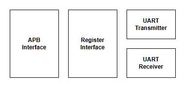

# Chapter 2: Testbench Architecture and Top-Level Flow



## What You Should Learn in This Chapter

This chapter explains how the overall UVM testbench is organized.

By the end, you should understand:

- how the major blocks connect together,
- why loopback makes this tutorial easier to follow,
- what the top-level module is responsible for,
- and why virtual interfaces are necessary.

## 2.1 The Big Picture of the Environment

The example environment is intentionally small. That is a strength, not a limitation.

It contains:

- one top-level testbench module,
- one base test,
- one environment,
- one APB agent,
- one UART agent,
- one scoreboard,
- and a small number of focused tests and sequences.

A good high-level picture of the verification data flow is:

```text
                 +----------------------+
                 |      UVM test        |
                 +----------+-----------+
                            |
                            v
                 +----------------------+
                 |      sequences       |
                 +----------+-----------+
                            |
             +--------------+--------------+
             |                             |
             v                             v
   +-------------------+         +-------------------+
   |   APB sequencer   |         |  UART sequencer   |
   +---------+---------+         +---------+---------+
             |                             |
             v                             v
   +-------------------+         +-------------------+
   |    APB driver     |         |    UART driver    |
   +---------+---------+         +---------+---------+
             |                             |
             +-------------+  +------------+
                           |  |
                           v  v
                      +-----------+
                      |    DUT    |
                      +-----------+
                           |  |
             +-------------+  +------------+
             |                             |
             v                             v
   +-------------------+         +-------------------+
   |    APB monitor    |         |   UART monitor    |
   +---------+---------+         +---------+---------+
             |                             |
             +-------------+  +------------+
                           |  |
                           v  v
                     +--------------+
                     |  scoreboard  |
                     +--------------+
```

Read that diagram slowly.

- Tests and sequences create intent.
- Drivers turn that intent into real interface activity.
- Monitors observe what actually happened.
- The scoreboard compares observations and decides whether the DUT behaved correctly.

That is the heart of the UVM model.

## 2.2 Why the Loopback Setup Is So Helpful

A beginner-friendly feature of this APB-UART environment is the loopback-style connection between the UART pins.

A representative DUT hookup looks like this:

```systemverilog
uart_top #(
    .ADDR_WIDTH(SYS_ADDR_WIDTH),
    .DATA_WIDTH(SYS_DATA_WIDTH)
) udut (
    .arst_ni(ctrl_intf.arst_ni),
    .clk_i(ctrl_intf.clk_i),
    .psel_i(apb_intf.psel),
    .penable_i(apb_intf.penable),
    .paddr_i(apb_intf.paddr),
    .pwrite_i(apb_intf.pwrite),
    .pwdata_i(apb_intf.pwdata),
    .pstrb_i(apb_intf.pstrb),
    .pready_o(apb_intf.pready),
    .prdata_o(apb_intf.prdata),
    .pslverr_o(apb_intf.pslverr),
    .rx_i(uart_intf.tx),
    .tx_o(uart_intf.rx)
);
```

In plain language, the transmit and receive sides are cross-connected so the environment can observe complete paths without needing a second external UART device model.

That gives us clean end-to-end stories:

- write a byte through APB,
- watch it emerge through the UART path,
- inject UART receive traffic,
- read the same data back through APB.

For a trainee engineer, this removes a lot of distraction.

## 2.3 What the Top-Level Module Should Do

A common beginner mistake is to put too much verification logic in the top-level module. In UVM, the top-level module should stay thin.

Its main responsibilities are:

1. instantiate the DUT,
2. instantiate interfaces,
3. publish those interfaces and parameters to the class world,
4. start the UVM test.

A representative startup block looks like this:

```systemverilog
initial begin
    string test_name;

    if (!$value$plusargs("UVM_TESTNAME=%s", test_name) &&
        !$value$plusargs("test=%s", test_name)) begin
        test_name = "base_test";
    end

    uvm_config_db#(int)::set(uvm_root::get(), "parameter", "ADDR_WIDTH", ADDR_WIDTH);
    uvm_config_db#(int)::set(uvm_root::get(), "parameter", "DATA_WIDTH", DATA_WIDTH);

    uvm_config_db#(virtual ctrl_if)::set(uvm_root::get(), "ctrl", "ctrl_intf", ctrl_intf);
    uvm_config_db#(virtual uart_if)::set(uvm_root::get(), "uart", "uart_intf", uart_intf);
    uvm_config_db#(virtual apb_if)::set(uvm_root::get(), "apb", "apb_intf", apb_intf);

    run_test(test_name);
end
```

A trainee engineer should learn three important ideas from this block.

### Runtime test selection

The same compiled testbench can run different tests depending on the plusarg. This is one reason UVM scales well.

### Configuration publishing

The module does not manually hand values to every class instance. Instead, it publishes information through `uvm_config_db`.

### Thin top-level design

The top-level module bootstraps the UVM class world. It should not become a second procedural testbench that competes with the class hierarchy.

## 2.4 What Is a Virtual Interface?

This is one of the most common beginner questions.

SystemVerilog modules can instantiate real interfaces directly. SystemVerilog classes cannot interact with those interfaces the same way unless they receive a handle.

A virtual interface is that handle.

The flow is:

1. the top-level module creates real interfaces,
2. the module stores virtual-interface handles in `uvm_config_db`,
3. drivers, monitors, and tests retrieve those handles and use them.

Without a virtual interface, a driver would not have a clean way to access APB or UART signals and tasks.

## 2.5 Why `uvm_config_db` Exists

At first glance, `uvm_config_db` can look like unnecessary complexity. But it solves a real organizational problem.

Many UVM components need shared information such as:

- interface handles,
- parameter values,
- default configuration values,
- sequence lengths,
- protocol settings.

If everything were passed manually through constructors, the code would quickly become deeply coupled and hard to maintain.

`uvm_config_db` gives the environment a standard place to publish and retrieve configuration state.

A trainee engineer does not need to master every detail of it immediately. At this stage, it is enough to understand:

- the top level publishes things,
- components retrieve things,
- and this allows the class world to stay flexible.

## 2.6 What the Environment Owns

The environment is the top-level UVM class container for the main verification blocks.

A representative implementation looks like this:

```systemverilog
class apb_uart_env extends uvm_env;
    apb_agent apb;
    uart_agent uart;
    apb_uart_scbd scbd;

    virtual function void build_phase(uvm_phase phase);
        super.build_phase(phase);
        apb  = apb_agent::type_id::create("apb", this);
        uart = uart_agent::type_id::create("uart", this);
        scbd = apb_uart_scbd::type_id::create("scbd", this);
    endfunction

    function void connect_phase(uvm_phase phase);
        super.connect_phase(phase);
        apb.mon.ap.connect(scbd.m_analysis_imp_apb);
        uart.mon.ap.connect(scbd.m_analysis_imp_uart);
    endfunction
endclass
```

This is a good beginner example because it shows what an environment should do:

- create its main subcomponents,
- connect them,
- avoid containing scenario-specific stimulus.

The environment is the structure. The tests provide the behavior.

## 2.7 What the Architecture Diagram Is Telling You

Do not treat the architecture figure as decoration. It gives you a visual map of the DUT's major blocks and data flow.

When you see a diagram like this in a verification tutorial, use it to ask:

- Which blocks are configured from APB registers?
- Which blocks influence transmission?
- Which blocks influence reception?
- Where would you expect status and data to be visible?

That habit will make both design debugging and verification planning easier later in your career.

## 2.8 The Main Lesson of This Chapter

If you leave this chapter understanding the following sentence, you are on track:

"The top-level module only boots the UVM world, the environment organizes the main blocks, and virtual interfaces allow class-based components to touch real interface signals."

That is the structural foundation for the rest of the tutorial.

## Previous and Next

Previous: [Chapter 1: Understanding the Problem and the Language](01-understanding-the-problem-and-the-language.md)

Next: [Chapter 3: UVM Phases, Objections, and the Base Test](03-uvm-phases-objections-and-the-base-test.md)