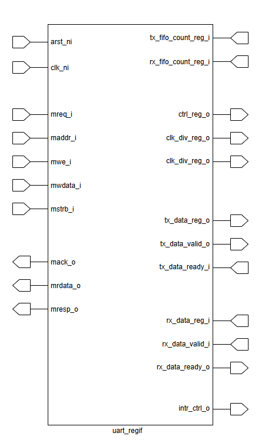

# Chapter 3: UVM Phases, Objections, and the Base Test



## What You Should Learn in This Chapter

This chapter explains how the simulation moves through time at the UVM testbench level.

By the end, you should understand:

- what the main UVM phases are doing in this example,
- why the base test is so important,
- and what objections mean in practice.

## 3.1 Why Phases Exist at All

A beginner often sees UVM phases as an arbitrary list of method names. That makes them hard to remember.

A better way to think about phases is this:

Phases are a structured way to separate different kinds of work so the testbench does not become chaotic.

Instead of doing everything in one place, UVM encourages an ordered flow:

- build the components,
- connect the components,
- reset the DUT,
- configure the DUT,
- run the scenario,
- summarize the result.

That is much easier to maintain than an unstructured procedural test.

## 3.2 The Most Important Phases in This Example

This example uses a subset of the full UVM phase system, and that is a good thing for training.

### `build_phase`

This is where components are created.

Typical actions here include:

- creating the environment,
- creating the APB and UART agents,
- creating the scoreboard.

### `connect_phase`

This is where connections are made.

Typical actions here include:

- connecting monitor analysis ports to the scoreboard,
- retrieving virtual interfaces if the component needs them.

### `reset_phase`

This is where the DUT is placed into a known, clean starting state.

Typical actions here include:

- asserting reset,
- clearing interface signals,
- waiting for the reset sequence to complete safely.

### `configure_phase`

This is where the DUT is programmed for the upcoming test scenario.

Typical actions here include:

- setting baud-rate related values,
- programming parity and stop-bit settings,
- enabling the clock,
- sending an initial APB setup sequence.

### `main_phase`

This is where the actual scenario stimulus runs.

Typical actions here include:

- randomized APB writes to transmit data,
- UART receive traffic generation,
- APB reads from receive data,
- register sweeps.

### `report_phase`

This is where final summaries are produced.

Typical actions here include:

- reporting coverage information,
- reporting pass or fail status.

## 3.3 Why the Base Test Is So Important

The base test is one of the most important ideas in a reusable UVM environment.

Without a base test, every scenario test tends to repeat the same work:

- retrieve interfaces,
- reset the DUT,
- start the clock,
- program default register values,
- enable the design.

That repetition causes two problems:

- duplicated code,
- inconsistent setup between tests.

A base test solves this by holding the setup that every test should share.

In this APB-UART example, the base test is responsible for:

- building the environment,
- retrieving virtual interfaces,
- applying reset,
- setting default UART parameters,
- enabling the clock,
- starting the initial APB configuration sequence.

That means derived tests can focus on the scenario they are trying to prove.

## 3.4 A Close Look at the Configuration Phase

The configuration phase is especially useful for training because it shows how setup is performed in a deliberate, readable way.

```systemverilog
virtual task configure_phase(uvm_phase phase);
    super.configure_phase(phase);
    phase.raise_objection(this);

    uart_intf.BAUD_RATE = 6_250_000;
    uart_intf.PARITY_ENABLE = 0;
    uart_intf.PARITY_TYPE = 0;
    uart_intf.SECOND_STOP_BIT = 0;
    uart_intf.DATA_BITS = 8;

    uvm_config_db#(int)::set(uvm_root::get(), "uart", "baud_rate", uart_intf.BAUD_RATE);
    uvm_config_db#(bit)::set(uvm_root::get(), "uart", "parity_enable", uart_intf.PARITY_ENABLE);
    uvm_config_db#(bit)::set(uvm_root::get(), "uart", "parity_type", uart_intf.PARITY_TYPE);
    uvm_config_db#(bit)::set(uvm_root::get(), "uart", "second_stop_bit", uart_intf.SECOND_STOP_BIT);
    uvm_config_db#(int)::set(uvm_root::get(), "uart", "data_bits", uart_intf.DATA_BITS);

    enable_clock(10ns);

    begin
        uart_en_apb_seq my_seq;
        my_seq = uart_en_apb_seq::type_id::create("my_seq");
        my_seq.start(env.apb.seqr);
        apb_intf.wait_till_idle();
    end

    phase.drop_objection(this);
endtask
```

Read this in slow motion.

### First, the test raises an objection

That tells UVM not to let the phase end while configuration is still running.

### Second, UART defaults are established

The UART interface is given known default values for baud rate, parity, stop bits, and data width.

### Third, those values are also published through `uvm_config_db`

This allows other parts of the environment, such as monitors or scoreboards, to use the same assumptions.

### Fourth, the clock is enabled

A design cannot meaningfully process transactions without a stable running clock.

### Fifth, an APB setup sequence is executed

This programs the DUT through the same APB path a real system would use.

### Finally, the objection is dropped

That tells UVM the configuration work for this phase is finished.

## 3.5 What an Objection Really Means

Objections confuse many beginners because the name sounds more abstract than the actual idea.

An objection is simply UVM's way of saying:

"I am still doing important work. Do not let this phase end yet."

The pattern is:

1. raise an objection before starting meaningful work,
2. do the work,
3. drop the objection when the work is complete.

If all objections for that phase are dropped, UVM is free to move forward.

Why does this matter?

Because without objections, a phase could end too early:

- before a sequence finishes,
- before UART traffic has drained,
- before the scoreboard has observed the final transactions.

That would make the testbench fragile and misleading.

## 3.6 Why Derived Tests Should Stay Small

A trainee engineer sometimes feels that a test is not "real" unless it contains a lot of code. In good UVM, smaller tests are often better.

A derived test should usually focus on:

- what unique stimulus it starts,
- what traffic it wants to exercise,
- and when it should wait for interfaces to go idle.

Everything that is common should remain in the base test.

That is not just a style preference. It keeps the environment consistent and easier to debug.

## 3.7 The Role of Reset in Verification Quality

Reset is more than a ritual. It is one of the most important parts of making a test reproducible.

A clean reset sequence ensures:

- the DUT begins in a known state,
- stale interface values do not leak from previous activity,
- tests behave consistently from run to run.

One of the fastest ways to create hard-to-debug failures is to start stimulus before reset and configuration are complete.

## 3.8 The Main Lesson of This Chapter

If you leave this chapter understanding the sentence below, you are ready to move on:

"Phases keep the testbench organized, objections prevent phases from ending too early, and the base test centralizes all common setup so scenario tests stay focused."

That is the execution backbone of the environment.

## Previous and Next

Previous: [Chapter 2: Testbench Architecture and Top-Level Flow](02-testbench-architecture-and-top-level-flow.md)

Next: [Chapter 4: Agents, Sequences, and End-to-End Data Paths](04-agents-sequences-and-end-to-end-data-paths.md)
##### Copyright (c) 2026 squared-studio

