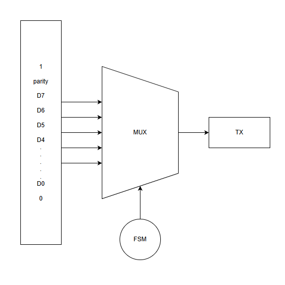
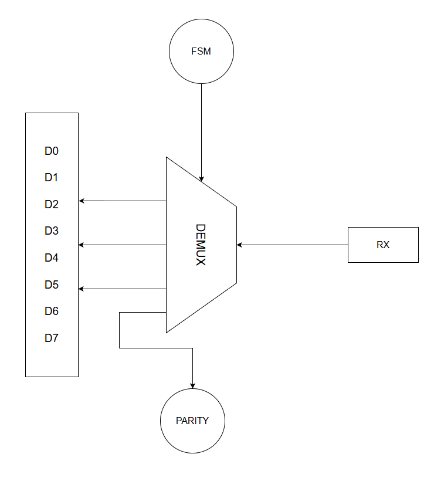

# Chapter 4: Agents, Sequences, and End-to-End Data Paths





## What You Should Learn in This Chapter

This chapter explains what is inside an agent and then walks slowly through the most important TX and RX data paths in the testbench.

By the end, you should understand:

- what sequencers, drivers, and monitors each do,
- why APB and UART use separate agents,
- how `basic_write_test` proves the transmit path,
- how `basic_read_test` proves the receive path.

## 4.1 What Is Inside an Agent?

An agent is a container for everything needed to work with one interface.

In this example, each agent contains:

- a sequencer,
- a driver,
- a monitor,
- and an analysis port.

That sounds abstract at first, so let us slow it down.

### The sequence item

A sequence item represents one transaction.

Examples:

- one APB write to `TX_DATA`,
- one APB read from `RX_DATA`,
- one UART byte being transmitted or received.

### The sequence

A sequence creates one or more sequence items.

This is where test intent lives.

Examples:

- generate 256 random APB writes to the transmit data register,
- generate 256 random UART receive bytes.

The sequence describes what to do, not how to toggle individual pins.

### The sequencer

The sequencer is the coordinator between the sequence and the driver.

A beginner does not need to overcomplicate this. Think of it as the delivery point that hands transactions from the sequence into the driver.

### The driver

The driver converts a transaction into real signal activity.

For APB, that means driving the APB protocol correctly.

For UART, that means serializing bits with the correct timing and framing.

### The monitor

The monitor observes interface activity and reconstructs transactions from what actually happened.

This distinction is essential:

- drivers create interface activity,
- monitors report interface activity.

A monitor should never "pretend" the DUT was correct. It must report what it truly saw.

## 4.2 Why APB and UART Use Different Agents

A trainee engineer may ask, "Why not have one big agent for the entire DUT?"

Because the APB and UART interfaces are doing fundamentally different jobs.

### The APB agent

The APB agent is responsible for the software-visible side of the DUT.

It handles:

- register reads and writes,
- configuration programming,
- reading and writing data registers,
- observing APB responses.

### The UART agent

The UART agent is responsible for the serial communication side.

It handles:

- injecting receive traffic,
- observing transmit traffic,
- decoding or encoding byte-level UART activity,
- tracking framing-related behavior.

Keeping these separate makes the environment easier to understand and easier to extend.

## 4.3 The Basic Write Test: APB to UART

The most important beginner transmit question is:

If software writes bytes through APB, do those same bytes come out of the UART transmitter?

That is the purpose of `basic_write_test`.

A representative stimulus setup looks like this:

```systemverilog
random_apb_wdata_seq my_seq;
uvm_config_db#(int)::set(uvm_root::get(), "parameter", "RANDOM_APB_WDATA_SEQ_LENGTH", 256);
my_seq = random_apb_wdata_seq::type_id::create("my_seq");
my_seq.start(env.apb.seqr);
```

This is a very common UVM pattern:

- configure the sequence behavior,
- create the sequence object,
- start it on the appropriate sequencer.

### Step-by-step transmit flow

#### Step 1: The test starts an APB write sequence

The sequence is configured to generate repeated writes to `TX_DATA` at address `0x14`.

#### Step 2: The APB sequence creates transactions

Conceptually, each transaction says:

- this is a write,
- the address is `0x14`,
- the data is one randomized byte.

#### Step 3: The APB driver turns those transactions into bus activity

The driver performs the APB protocol correctly by driving the proper setup and enable timing on the APB interface.

#### Step 4: The DUT accepts the bytes into the transmit path

Once the bus write is accepted, the DUT pushes the data into its transmit path.

#### Step 5: The UART side begins serial transmission

The data is serialized and appears as UART activity on the serial interface.

#### Step 6: The UART monitor reconstructs the byte

The UART monitor watches the serial line, decodes the frame, and publishes a byte-level transaction.

#### Step 7: The scoreboard compares the APB write against the UART transmit byte

If they match, the transmit path is behaving correctly.

If they do not match, the scoreboard flags a failure.

That is a complete end-to-end check from a register write to a serial-line observation.

## 4.4 The Basic Read Test: UART to APB

The opposite direction is equally important.

The verification question is:

If serial data arrives on the UART receive side, can software later read that same data through APB?

That is the purpose of `basic_read_test`.

### Step-by-step receive flow

#### Step 1: The test starts a UART receive sequence

The UART-side sequence generates randomized receive bytes.

#### Step 2: The UART driver serializes and drives the receive traffic

The bytes are driven into the DUT using real UART framing behavior.

#### Step 3: The DUT receives and stores the data

The DUT processes the serial input and makes the data available on the receive side, typically through an RX FIFO and receive data register path.

#### Step 4: An APB read sequence reads from `RX_DATA`

After receive traffic has been injected, the APB side reads from `0x18`.

#### Step 5: The APB monitor reports what data came back

The APB monitor observes the returned read data exactly as it appeared on the bus.

#### Step 6: The scoreboard compares the APB read against the UART receive byte

If the APB read value matches the UART receive queue, the receive path is working correctly.

That is the second major end-to-end proof in the environment.

## 4.5 Why Waiting for Idle Matters

Tests in this environment often wait for APB and UART interfaces to become idle after starting stimulus.

That is not cosmetic.

It matters because:

- APB traffic may still be completing,
- UART serial transfers take longer than bus writes,
- monitors and scoreboards may still be receiving final observations.

If a phase ends too early, the test can appear to fail randomly or miss valid comparisons.

This is one of the most common sources of beginner confusion in protocol-based verification.

## 4.6 What You Should Be Able to Explain Now

Before moving on, you should be able to describe the following in your own words:

- what makes a sequence different from a driver,
- what makes a driver different from a monitor,
- why APB and UART are handled by different agents,
- and how one byte moves from APB write to UART observation, or from UART injection to APB readback.

If you can explain those flows clearly, you are already thinking like a verification engineer rather than just reading code mechanically.

## Previous and Next

Previous: [Chapter 3: UVM Phases, Objections, and the Base Test](03-uvm-phases-objections-and-the-base-test.md)

Next: [Chapter 5: Scoreboard, Coverage, and What the Tests Prove](05-scoreboard-coverage-and-what-the-tests-prove.md)
##### Copyright (c) 2026 squared-studio

