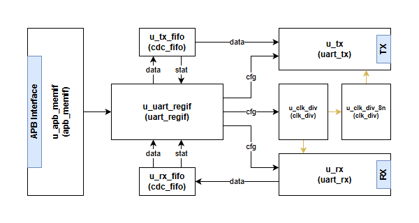

# Chapter 5: Scoreboard, Coverage, and What the Tests Prove



## What You Should Learn in This Chapter

This chapter explains how the environment decides whether the DUT behaved correctly and how it measures what has been exercised.

By the end, you should understand:

- why the scoreboard is the main checker,
- why separate queues are used for APB and UART observations,
- how end-to-end compares are performed,
- and why coverage still matters even in a small environment.

## 5.1 Why the Scoreboard Is So Important

A UVM environment is not complete just because it can generate traffic. Real verification begins when the environment can decide whether the DUT was correct.

That is the scoreboard's job.

In this APB-UART example, the scoreboard is particularly educational because it compares two different views of the same design:

- what APB activity asked the DUT to do,
- what UART behavior actually happened.

This makes it much stronger than a checker that only looks at one interface in isolation.

## 5.2 The Scoreboard's Three Main Jobs

The scoreboard performs three important functions.

### Job 1: Store APB and UART observations separately

The scoreboard keeps separate storage for:

- APB response items,
- UART transmit bytes,
- UART receive bytes.

Why separate queues?

Because APB and UART do not operate on the same time scale.

- APB transactions complete in bus cycles.
- UART transactions unfold at serial bit timing.

The scoreboard uses queues so each side can arrive when it is ready and still be compared correctly.

### Job 2: Track active configuration

The scoreboard watches APB writes to configuration-related addresses.

For example:

- a write to the divider register changes baud-rate expectations,
- a write to the configuration register changes parity and stop-bit expectations.

This keeps the checking logic aligned with how the DUT was actually programmed.

### Job 3: Compare the two important data flows

The scoreboard compares:

- APB writes to `TX_DATA` against observed UART transmit bytes,
- APB reads from `RX_DATA` against observed UART receive bytes.

That is the central end-to-end proof of this environment.

## 5.3 A Simplified View of the Compare Logic

A simplified version of the main scoreboard logic looks like this:

```systemverilog
if (apb_item.pwrite == 1 && apb_item.paddr == 'h14) begin
    byte data;
    wait (uart_tx_q.size());
    data = uart_tx_q.pop_front();
    if (data != apb_item.pwdata[7:0]) begin
        `uvm_error(get_type_name(), "TX data mismatch")
    end
end
else if (apb_item.pwrite == 0 && apb_item.paddr == 'h18) begin
    byte data;
    wait (uart_rx_q.size());
    data = uart_rx_q.pop_front();
    if (data != apb_item.prdata[7:0]) begin
        `uvm_error(get_type_name(), "RX data mismatch")
    end
end
```

A trainee engineer should notice something very important here:

The scoreboard does not always compare two events instantly. Sometimes it stores one observation, waits for the matching observation to appear later, and then performs the comparison.

That is a very common real-world verification pattern.

## 5.4 What the Scoreboard Is Really Proving

Let us translate the scoreboard checks into plain language.

### APB write to `TX_DATA`

When software writes a byte into the transmit register:

- the DUT should eventually send that byte through the UART transmit path,
- the UART monitor should observe that byte,
- the scoreboard should confirm the transmitted byte matches what software wrote.

### APB read from `RX_DATA`

When the DUT has received a UART byte:

- the byte should become available through the receive data register path,
- an APB read should return that value,
- the scoreboard should confirm the APB read matches what the UART side received.

This is why the environment is educational: it proves agreement across interfaces.

## 5.5 Why Coverage Still Matters

A beginner sometimes thinks that if the scoreboard reports no errors, the environment is finished.

That is not true.

Pass fail checking answers:

- Did the observed checks succeed?

Coverage answers:

- What important scenarios have actually been exercised?

In this environment, functional coverage is collected for areas such as:

- APB transaction behavior,
- UART transaction behavior,
- register access behavior,
- test pass or fail status.

Coverage matters because you can easily have a test that never fails but still misses large parts of the behavior space.

Examples:

- you may never enable parity,
- you may never exercise some register access combinations,
- you may only test one data direction,
- you may never stress boundary conditions.

Coverage helps expose those blind spots.

## 5.6 What Each Core Test Proves

The environment does not need many tests if each test has a clear purpose.

### `base_test`

This proves:

- the environment builds correctly,
- reset and configuration flow are working,
- the UVM phase structure is alive and coherent.

### `basic_write_test`

This proves:

- APB-side transmit writes are accepted,
- the UART transmit path emits the expected bytes,
- the APB-to-UART end-to-end path is correct.

### `basic_read_test`

This proves:

- UART receive traffic can be injected,
- the received data becomes visible through APB,
- the UART-to-APB end-to-end path is correct.

### `all_reg_access_test`

This proves more about:

- register map accessibility,
- broader access-pattern coverage,
- exercising more than just the main data registers.

A trainee engineer should learn from this that a strong test suite usually mixes:

- core data-path tests,
- control and configuration tests,
- coverage-broadening tests.

## 5.7 What the Scoreboard Does Not Automatically Prove

Another useful lesson is to understand the limits of the current checking model.

The scoreboard is very strong for:

- TX data comparisons,
- RX data comparisons,
- basic APB and UART observation correlation,
- configuration-aware checking.

But it does not automatically prove every possible feature unless you extend it.

Examples that may require extra checking logic include:

- interrupt behavior,
- FIFO threshold behavior,
- parity error reporting,
- illegal access behavior,
- corner cases around flush operations.

This is an important professional habit: always ask not only what is checked, but also what is not yet checked.

## 5.8 The Main Lesson of This Chapter

If you leave this chapter understanding the sentence below, you are ready for the final extension chapter:

"The scoreboard turns observations into proof of correctness, and coverage tells us how much of the intended behavior space we have actually exercised."

That is the quality-assurance core of the environment.

## Previous and Next

Previous: [Chapter 4: Agents, Sequences, and End-to-End Data Paths](04-agents-sequences-and-end-to-end-data-paths.md)

Next: [Chapter 6: Extending the Environment as a New Verification Engineer](06-extending-the-environment-as-a-new-verification-engineer.md)